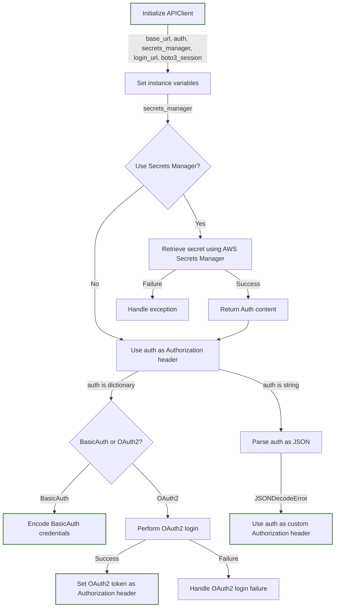
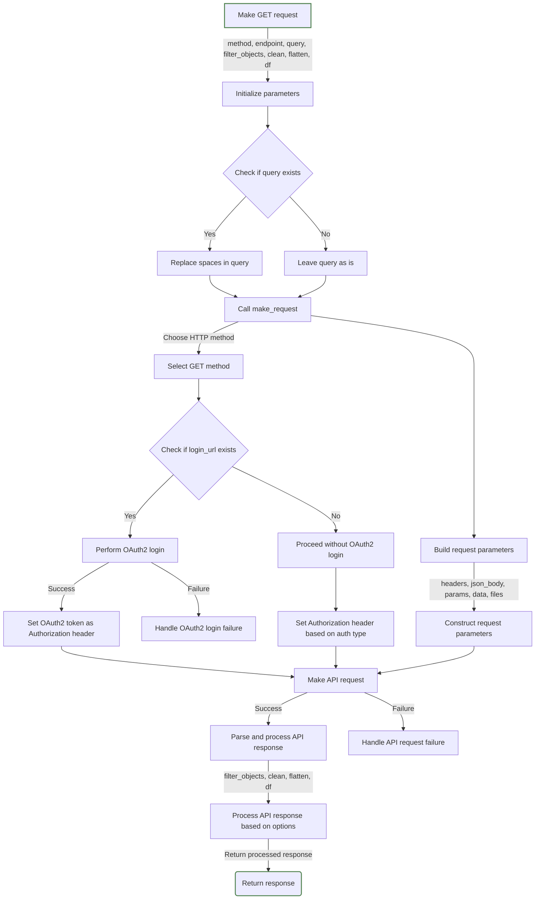

# APIClient

The `APIClient` is a versatile Python class designed to handle API requests with various authentication methods. It supports token authentication, BasicAuth, OAuth2, and custom Authorization headers. Additionally, it provides the option to use AWS Secrets Manager for securely managing API credentials.

Tested with: HiBob, Salesforce, Amplitude, Marketing cloud.

## Installation

```bash
pip install requests boto3 pandas
```

## Importing

```bash
from api_client import APIClient
```
## Parameters
* base_url (str): The API base URL.
* auth (str/dict): API credentials or custom "Authorization" header.
* secrets_manager (bool): Whether to use AWS Secrets Manager for authentication.
* login_url (str): Login URL for OAuth2.
* boto3_session (boto3.Session): Custom boto3 session.

## Usage: Initialize the API client
### General
```bash
api_client= APIClient(
    auth= dict | str  # req. Credintials dict/custom Auth header string/secrets manager path string.
    base_url= "https://api.example.com/", # opt. not required with Salesforce
    secrets_manager= False,  # opt. Set to True if using AWS Secrets Manager
    login_url= "https://oauth.example.com/login",  # opt. Specify only for OAuth2
    boto3_session= session # opt. Pass a custom boto3 session if running locally
)
```
### Sample1: Token auth (ex. HiBob)
```bash
api_client= APIClient(
    base_url= "https://api.hibob.com/v1/",
    auth= "your_api_key",
)
```
### Sample2: Basic auth (ex. Amplitude/HiBob)
```bash
api_client= APIClient(
    base_url= "https://amplitude.com/api/3/",
    auth= {
        "api_key / username":"your_api_key",
        "secret_key / password":"your_secret_key"
    },
)
```
### Sample3: OAuth2 (ex. Salesforce)
```bash
api_client= APIClient(
    login_url= "https://test.salesforce.com/services/oauth2/token",
    auth= {
        'grant_type':'password',
        'client_id':'',
        'client_secret':'',
        'username':'',
        'password':''
    }
)
```
### Sample4: Custom Authorization header
`APIClient` will use the auth string as is without further processing.
```bash
api_client= APIClient(
    base_url= "https://api.example.com/",
    auth= "Bearer / Basic ..."
)
```
### Sample5: ***(Recommended)*** Getting auth content from AWS Secrets Manager
```bash
    # Add to any sample of the above:
    api_client= APIClient(
        ...
    auth= "data/api/sample" # Secrets manager path name of Auth content
    secrets_manager= True
    )
```


## Methods
* get(endpoint, query, filter_objects, clean, flatten, df): Perform a GET request with optional processing.
* post(endpoint, json_body, query, body, files, filter_objects, clean, flatten, df): Perform a POST request.
* put(endpoint, json_body, query, body, files): Perform a PUT request.
* delete(endpoint, json_body, query, body, files): Perform a DELETE request.

## Usage: Make a GET request:
### General
```bash
response= api_client.get(
    endpoint= "data/query/", # req. Sample endpoint
    query= "sample_query=true", # opt. Query spaces will convert to "+"
    filter_objects= ["object1","object3"], # opt. List of target keys
    clean= True, # opt. Remove new lines and double spaces
    flatten= True, # opt. Flatten/Normalize reponse nested structure
    df= True # opt. Convert to df with "date" and "timestamp_extracted" columns
    )
```
### Sample1 (HiBob)
```bash
profiles= hibob_api.get(
    endpoint= "profiles",
    query= "humanReadable=true",
    filter_objects= ["employees"],
    clean= True,
    flatten= True,
    df= True
    )
```

### Sample2 (Amplitude)
```bash
chart_data= amplitude_api.get(
    endpoint= "chart/38xn7h3/query",
    filter_objects= ["data"],
    clean= True
    )
```
### Sample3 (Salesforce)
```bash
data= sf_api.get(
    endpoint= "services/data/v60.0/query/",
    filter_objects= ["done","nextRecordsUrl","records"],
    clean= True,
    query= "q=select Gone_Away__c, Bank_account_locations__c from Contact"
    )
```

### Make a POST request
```bash
payload= {"key":"value"}
response= api_client.post(endpoint="example_endpoint", json_body=payload)
```

### Other supported methods: PUT, DELETE

## Response Processing
The API responses can be filtered, cleaned, flattened, or converted to a Pandas DataFrame based on the provided arguments passed while making a request.


## Additional processing functions
### Clean
Runs a recursive algorithm that cleans response content by removing:
* Newline characters.
* Carriage return characters.
* Tab characters.
* Double spaces.

**Args**: str/list/dict
**Returns**: str/list/dict
```bash
cleaned_response= api_client.clean(response)
```

### Flatten
**Args**: list/dict
**Returns**: dict
```bash
flattened_response= api_client.flatten(response)
```

### Convert to Dataframe
Convert to df with "date" and "timestamp_extracted" columns added.

**Args**: dict
**Returns**: pd.DataFrame
```bash
data_frame= api_client.df_converter(response, flatten=True)
```
### Process Response
If you want to perform more than utility function together.
```bash
processed_response= api_client.process_response(response, filter_objects=["Object3"], clean=True, flatten=True, df=True)
```

## Flow Diagrams
### Intialize


##
### Make Request

   