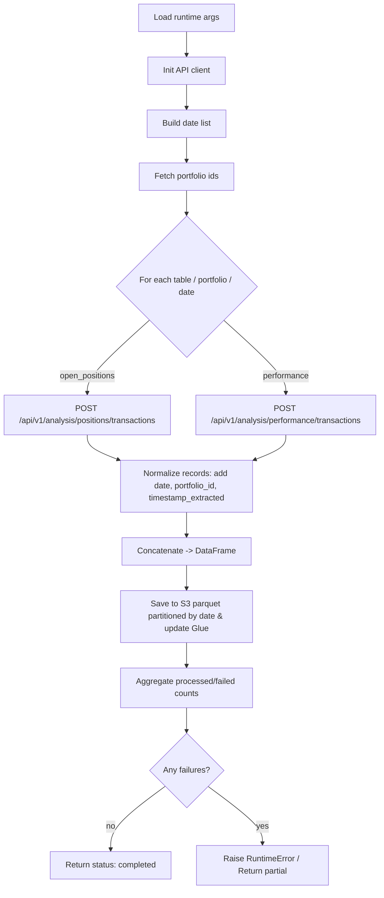
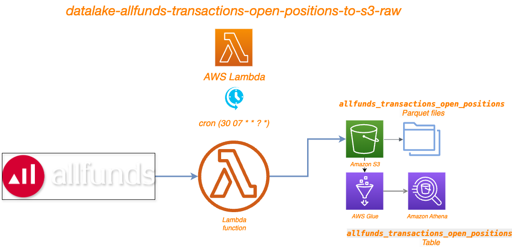

# AllFunds ETL — README

* **Purpose:** ETL pipeline to fetch AllFunds data and write partitioned Parquet to S3 (Glue/Athena friendly).
* **Entry point:** `main()` (script expects Glue runtime args or use `_MANUAL_EVENT` for local/testing).
* **Date handling:** `start_date`/`end_date` (YYYYMMDD); defaults to previous UTC day when absent.
* **Supported tables:** `allfunds_transactions_open_positions`, `allfunds_transactions_performance`.
* **Local override:** `_MANUAL_EVENT` allows specifying `athena_table_names`, `portfolio_ids`, `start_date`, `end_date` for testing.

## Workflow

## Architecture

