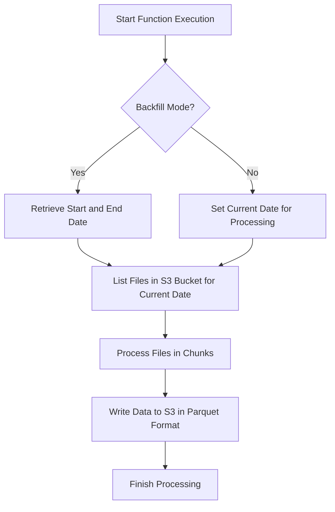

# Glue PythonShell Script for IMAL Reporting to S3
## Glue Function: Processing Large JSON Files in Chunks

## Description
This AWS PythonShell Glue function is designed to automate the extraction, transformation, and loading (ETL) process of financial data. Processes large JSON files stored in an S3 bucket by streaming and loading the data in chunks. It uploads the processed data to an Athena-compatible table in the Data Lake in Parquet format. 

## Function Arguments and Parameters
#### `backfill`: (Optional, Default: false) Determines if the function should load historical data. If set to true, start_date and end_date must be provided.
#### `start_date`: (Optional, Required if backfill is true) The start date for backfilling data, formatted as YYYY-MM-DD.
#### `end_date`: (Optional, Required if backfill is true) The end date for backfilling data, formatted as YYYY-MM-DD.

## Process Flow

## Key Operations
- `File Listing`: Based on the mode (backfill or daily), the function lists the JSON files in the S3 bucket that match the target dates.
- `Chunk Processing`: Files are streamed and loaded in chunks using `ijson`, and each chunk is converted into a Pandas DataFrame for processing.
- `Writing to S3`: The function writes the processed data chunks to S3 in Parquet format using AWS Data Wrangler, partitioning the data for Athena queries.
- `Schema Evolution`: The schema is dynamically generated and evolves based on the content of each processed chunk.

## BLME Reports Being Updated
the function searchs for and updates the below reports per each run:
- "CardTransactions"
- "CurrentAccountBalanceByDay"
- "FixedTermDepositFeesAndProfit"
- "CurrentAccountFTPandCompensation"
- "FixedTermDepositsByDay"
- "MortgageBalanceByDay"
- "MortgageFeesAndExpenses"
- "MortgageProfit"
- "FixedTermDepositFTP"
- "Cashback"
- "CardChargesAndFees"
- "CurrentAccountFeesAndProfit"
- "MultiCurrencyFeesAndIncome"
- "ArrearsDays"