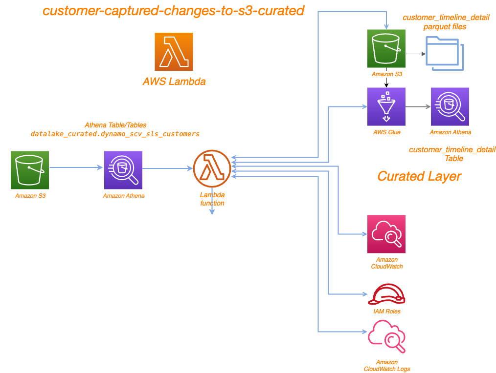

# Project Overview

The Lambda function processes events from a Kinesis Data Stream, parses the incoming data from AWS Dynamodb, transforms it, and writes the data to an AWS Athena table through AWS S3. It includes mechanisms to handle schema validation, updates, and writing to a fallback S3 location in case of errors. The key components of the project include:

	•	Importing necessary libraries and modules
	•	Fetching data from the Dynamodb
	•	Flattening data with flatten_json 
    •   Processing the data into a pandas DataFrame
	•	Saving the processed data to AWS S3 bucket ==> bb2-prod-datalake-curated/customer_timeline_detail

# Environment Variables

	•	S3_RAW: The S3 bucket for raw data.
	•	S3_ATHENA: The S3 bucket for Athena outputs.

# Dependencies

	•	boto3
	•	awswrangler
	•	pandas

# Running

	•	This Lambda has been triggerd by event scheduler.

# File Structure
    .
    ├── lambda_function.py               # Main script containing the Lambda handler
    └── requirements.txt          		 # List of required Python packages

# Digram

